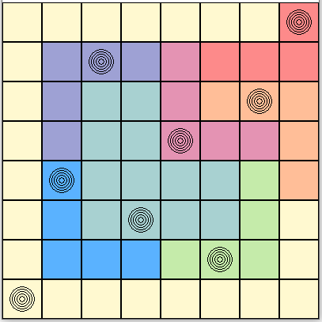
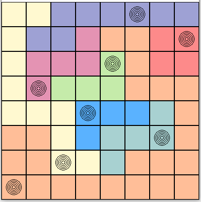

# N-Queens Problem

This code solves the N-Queens problem on a game board divided into color sectors, based on a recently added LinkedIn version.

Level 93             |  Level 94
:-------------------------:|:-------------------------:
  |  

## Solution 
The logic of the game is handled using First Order Logic (FOL). The rules are defined in Conjunctive Normal Form (CNF) and then used as input to a SAT solver.

### Tools used in code
- [PySAT](https://pysathq.github.io/)
- [Selenium](https://www.selenium.dev/)
- [python-dotenv](https://pypi.org/project/python-dotenv/)

## Game Rules 
The rules are similar to the regular N-Queens problem:

- There is at least one queen in every row.
- There is no more than one queen in any row.
- There is no more than one queen in any column.

In this version, we do not consider the diagonal rule but introduce two new rules:

- Positions adjacent to a queen must be empty.
- There is only one queen in each color sector.

## Color Palette
This color palette is used to define the game board:

| Code | Color      |
|------|------------|
| v    | Violet     |
| g    | Green      |
| r    | Red        |
| o    | Orange     |
| b    | Blue       |
| p    | Pink       |
| y    | Yellow     |
| t    | Teal Blue  |

## How to Run the Code  
The code can be run using predefined levels in text files or with data scraped directly from LinkedIn.

### Running Levels from Text Files
To run levels from a text file, ensure the level you are trying to run is an NxN grid and is defined with colors from the color palette above.

### Running Levels Using Web Scraping
*Disclaimer: Scraping is used for educational purposes only.*

To get data directly from LinkedIn we need to use Selenium to interact with JavaScript. If there is a problem accessing the web, you might need to download chromedriver and specify the path to its executable. (It might work without downloading and specifying chromedriver, but this error can occur.)

The code logs into LinkedIn account using your personal login data, then loads the queens game and scrapes the HTML element with the class "scaffold-layout__main,".

To log into LinkedIn, you need to create a file called `.env` in the main directory (the same place where `main.py` is located).

Contents of .env file:
```
EMAIL=youremail@example.com
PASSWORD=your_password
```

Scraping the game board will work only after you have solved the level. If not, it will not start the game and fail to extract the game board.